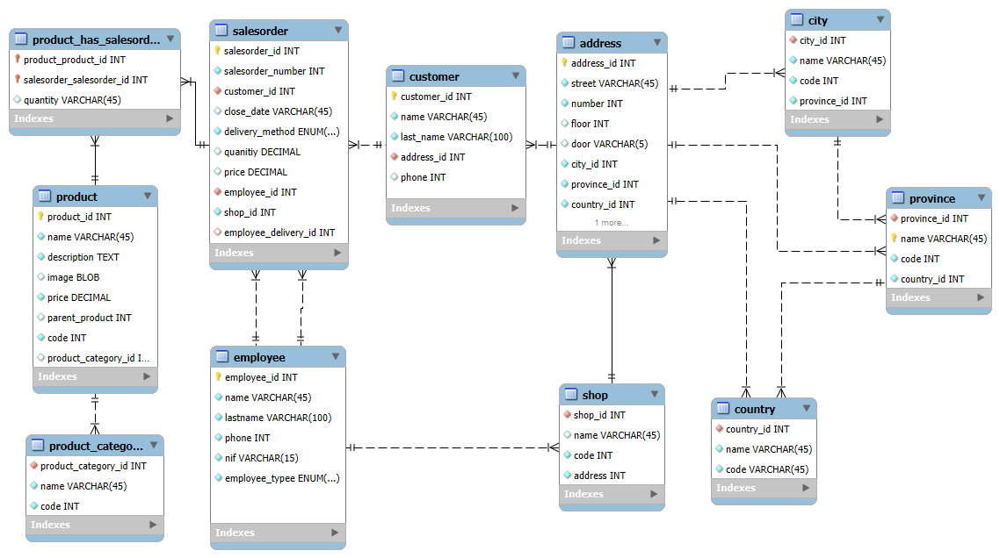

# 🍕Pizzeria

## 📄 Description

This database schema manages information about employees, stores, customers, addresses, orders, and products. It is designed for a store with both delivery and in-store services.

---

---

## 🔹 **Entities and Relationships**

### **1️⃣ Employee (`employee`)**
- Stores data about employees.
- Types of employees: cooks and delivery drivers.
- Relationship with: stores (`shop`) and orders (`salesorder`).

🗂 **Main Attributes:**  
- `employee_id`: Unique identifier for the employee.  
- `name`: Employee's first name.  
- `lastname`: Employee's last name.  
- `phone`: Phone number.  
- `nif`: Tax identification number (unique).  
- `employee_type`: Type of employee (cook or delivery driver).  

---

### **2️⃣ Store (`shop`)**
- Represents physical stores.  
- Relationship with: employees (`employee`) and addresses (`address`).  

🗂 **Main Attributes:**  
- `shop_id`: Unique identifier for the store.  
- `name`: Store name.  
- `code`: Store code (unique and auto-incremental).  
- `address`: Store's address.  

---

### **3️⃣ Address (`address`)**
- Stores address information.  
- Relationship with: stores (`shop`), customers (`customer`), and geographical locations (`city`, `province`, `country`).  

🗂 **Main Attributes:**  
- `address_id`: Unique identifier for the address.  
- `street`: Street name.  
- `number`: Building number.  
- `floor`: Floor (optional).  
- `door`: Door (optional).  
- `city_id`, `province_id`, `country_id`: Relationships with location.  
- `postal_code`: Postal code.  

---

### **4️⃣ Customer (`customer`)**
- Contains information about customers.  
- Relationship with: addresses (`address`) and orders (`salesorder`).  

🗂 **Main Attributes:**  
- `customer_id`: Unique identifier for the customer.  
- `name`: Customer's first name.  
- `last_name`: Customer's last name.  
- `address_id`: Relationship with the customer's address.  
- `phone`: Phone number (optional).  

---

### **5️⃣ City (`city`)**
- Defines available cities.  
- Relationship with: addresses (`address`) and provinces (`province`).  

🗂 **Main Attributes:**  
- `city_id`: Unique identifier for the city.  
- `name`: City name.  
- `code`: Unique city code.  
- `province_id`: Relationship with the province.  

---

### **6️⃣ Province (`province`)**
- Stores information about provinces.  
- Relationship with: cities (`city`) and countries (`country`).  

🗂 **Main Attributes:**  
- `province_id`: Unique identifier for the province.  
- `name`: Province name (primary key).  
- `code`: Unique province code.  
- `country_id`: Relationship with the country.  

---

### **7️⃣ Country (`country`)**
- Defines available countries.  
- Relationship with: provinces (`province`).  

🗂 **Main Attributes:**  
- `country_id`: Unique identifier for the country.  
- `name`: Country name.  
- `code`: ISO country code (unique).  

---

### **8️⃣ Order (`salesorder`)**
- Contains information about customer orders.  
- Relationship with: customers (`customer`), employees (`employee`), stores (`shop`), and products (`product`).  

🗂 **Main Attributes:**  
- `salesorder_id`: Unique identifier for the order.  
- `salesorder_number`: Order number (unique and auto-incremental).  
- `customer_id`: Relationship with the customer who made the order.  
- `close_date`: Order close date.  
- `delivery_method`: Delivery method (home delivery or in-store).  
- `quantity`: Total order quantity.  
- `price`: Total order price.  
- `employee_id`: Relationship with the assigned employee.  
- `shop_id`: Relationship with the store.  

---

### **9️⃣ Product (`product`)**
- Contains information about available products.  
- Relationship with: orders (`salesorder`) and categories (`product_category`).  

🗂 **Main Attributes:**  
- `product_id`: Unique identifier for the product.  
- `name`: Product name.  
- `description`: Detailed description.  
- `image`: Product image (optional).  
- `price`: Unit price.  
- `parent_product`: Parent product (if applicable).  
- `code`: Unique product code.  
- `product_category_id`: Relationship with the product category.  

---

### **🔟 Product in Order (`product_has_salesorder`)**
- Links products with orders.  

🗂 **Main Attributes:**  
- `product_product_id`: Relationship with the product.  
- `salesorder_salesorder_id`: Relationship with the order.  
- `quantity`: Quantity of the product in the order.  

---

### **1️⃣1️⃣ Product Category (`product_category`)**
- Classifies products into different categories.  

🗂 **Main Attributes:**  
- `product_category_id`: Unique identifier for the category.  
- `name`: Category name.  
- `code`: Unique and auto-incremental code.  

---

## 🏗 **Key Relationships**
- **Employee ↔ Store**: Each store has assigned employees.  
- **Employee ↔ Order**: Each order can be managed by an employee.  
- **Customer ↔ Order**: Each order belongs to a customer.  
- **Order ↔ Product**: Each order contains products.  
- **Product ↔ Category**: Each product belongs to a category.  
- **Store ↔ Address**: Each store has a specific address.  
- **Customer ↔ Address**: Each customer has a registered address.  
- **Address ↔ City/Province/Country**: Geographical location is stored.  
